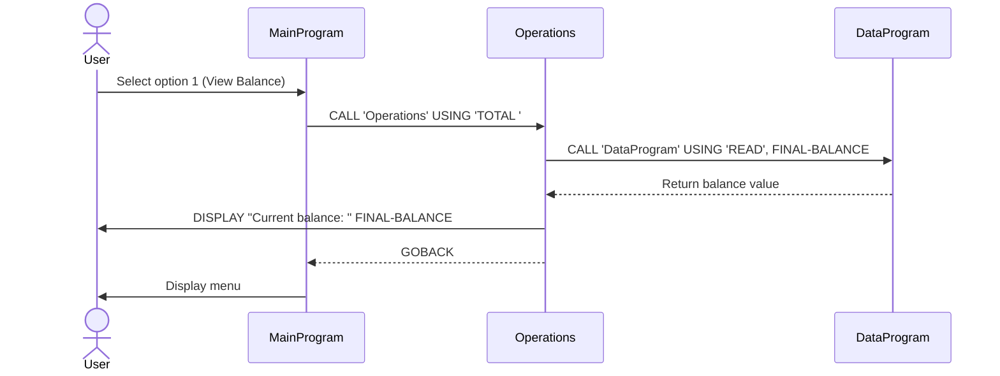
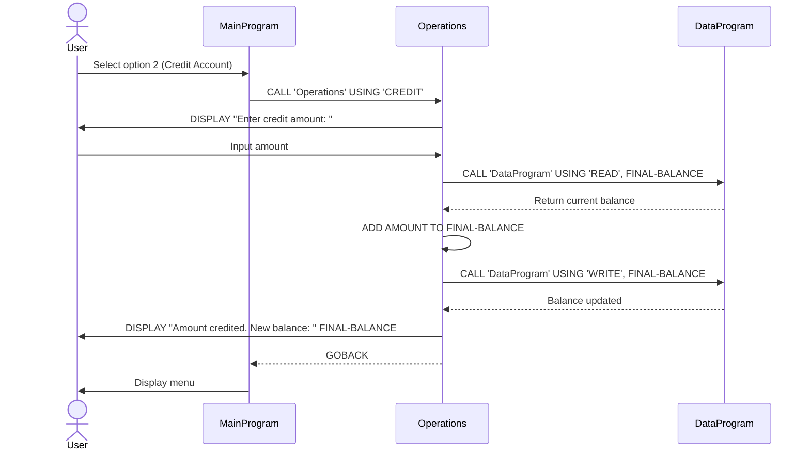
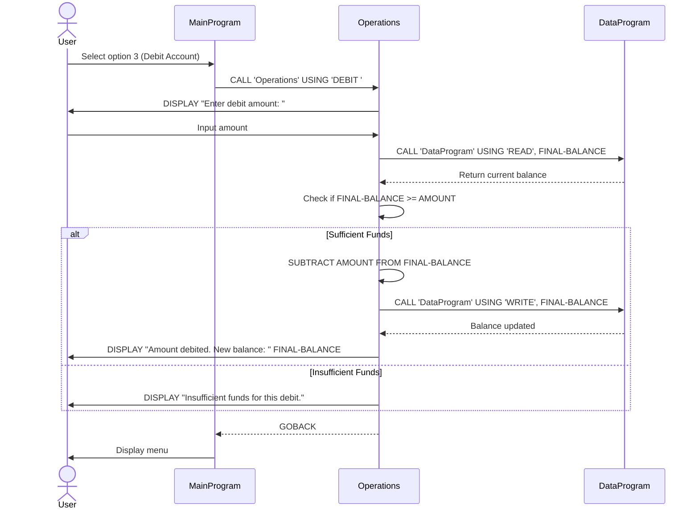
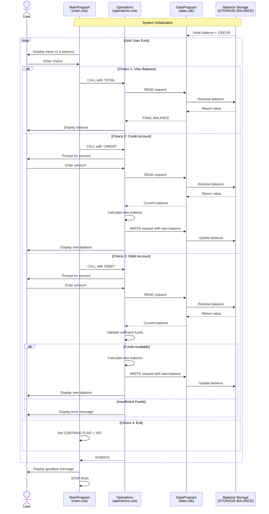

# COBOL Student Account Management System Documentation

## Overview

This legacy COBOL application implements a student account management system that handles account balance operations including viewing balances, crediting (depositing), and debiting (withdrawing) funds from student accounts.

## System Architecture

The application follows a modular design with three separate COBOL programs that work together:

1. **MainProgram** - User interface and menu system
2. **Operations** - Business logic for account operations
3. **DataProgram** - Data persistence layer

---

## File Descriptions

### 1. main.cob - MainProgram

**Purpose:** Entry point and user interface for the account management system.

**Key Functions:**
- Displays an interactive menu with account operation options
- Accepts user input for menu selection (1-4)
- Routes user requests to appropriate operation handlers
- Implements main program loop until user exits

**Program Flow:**
1. Displays menu with 4 options:
   - View Balance
   - Credit Account (deposit)
   - Debit Account (withdraw)
   - Exit
2. Accepts user choice
3. Calls `Operations` program with appropriate operation code
4. Repeats until user selects exit option

**Data Elements:**
- `USER-CHOICE`: Stores menu selection (numeric, 1-4)
- `CONTINUE-FLAG`: Controls program loop ('YES'/'NO')

**Business Rules:**
- Input validation: Only accepts choices 1-4
- Invalid input displays error message without terminating program
- Program continues until explicit exit command

---

### 2. operations.cob - Operations

**Purpose:** Implements the core business logic for all account operations.

**Key Functions:**

#### VIEW BALANCE ('TOTAL ')
- Retrieves current balance from data layer
- Displays balance to user
- Read-only operation

#### CREDIT ACCOUNT ('CREDIT')
- Prompts user for amount to credit
- Reads current balance
- Adds credit amount to balance
- Writes updated balance back to storage
- Displays new balance

#### DEBIT ACCOUNT ('DEBIT ')
- Prompts user for amount to debit
- Reads current balance
- Validates sufficient funds are available
- If funds available:
  - Subtracts debit amount from balance
  - Writes updated balance to storage
  - Displays new balance
- If insufficient funds:
  - Displays error message
  - No balance change occurs

**Data Elements:**
- `OPERATION-TYPE`: Type of operation requested (6 characters)
- `AMOUNT`: Transaction amount (up to 999,999.99)
- `FINAL-BALANCE`: Working balance variable (up to 999,999.99)

**Business Rules:**
- **Insufficient Funds Protection:** Debit operations cannot proceed if requested amount exceeds available balance
- **Decimal Precision:** All monetary values support 2 decimal places
- **Maximum Balance:** 999,999.99 (constrained by PIC 9(6)V99)
- **No Negative Balances:** System prevents overdrafts
- **Transaction Atomicity:** Balance updates are all-or-nothing operations

---

### 3. data.cob - DataProgram

**Purpose:** Manages persistent storage and retrieval of account balance data.

**Key Functions:**

#### READ Operation
- Retrieves current balance from storage
- Returns balance value to calling program

#### WRITE Operation
- Stores updated balance to persistent storage
- Overwrites previous balance value

**Data Elements:**
- `STORAGE-BALANCE`: Persistent balance storage (initialized to 1000.00)
- `OPERATION-TYPE`: Requested operation ('READ' or 'WRITE')

**Technical Details:**
- Acts as a simple data access layer
- Uses linkage section for parameter passing
- Maintains balance state across program calls
- Initial balance: 1000.00

**Business Rules:**
- **Default Starting Balance:** 1000.00 for new accounts
- **Single Account Model:** System manages one account balance
- **Direct Access:** No transaction logging or audit trail
- **Simple Storage:** In-memory persistence (no external database)

---

## Business Rules Summary

### Student Account Rules

1. **Initial Balance:** All student accounts start with a balance of 1000.00
2. **Balance Limits:**
   - Minimum: 0.00 (no negative balances allowed)
   - Maximum: 999,999.99 (system constraint)
3. **Transaction Types:**
   - Credit: Add funds to account (no maximum limit per transaction)
   - Debit: Remove funds from account (subject to available balance)
   - View: Read-only balance inquiry
4. **Overdraft Protection:** System prevents any debit that would result in negative balance
5. **Precision:** All monetary calculations use 2 decimal places
6. **Session Persistence:** Balance is maintained in memory during program execution

### System Constraints

- **Single User:** System handles one account at a time
- **No History:** Transactions are not logged or tracked
- **No Authentication:** No user validation or security layer
- **Synchronous Processing:** Operations execute sequentially
- **No Concurrent Access:** Not designed for multi-user environments

---

## Program Dependencies

```
MainProgram (main.cob)
    └─> Operations (operations.cob)
            └─> DataProgram (data.cob)
```

**Call Structure:**
- `MainProgram` calls `Operations` with operation code
- `Operations` calls `DataProgram` for balance read/write operations
- Programs communicate via COBOL `CALL` statement with parameter passing

---

## Data Flow

1. **User Input** → MainProgram accepts choice
2. **Menu Selection** → MainProgram calls Operations with operation type
3. **Business Logic** → Operations processes request
4. **Data Access** → Operations calls DataProgram to read/write balance
5. **Data Storage** → DataProgram manages balance persistence
6. **Response** → Results displayed to user via Operations or MainProgram

---

## Modernization Considerations

This legacy system would benefit from modernization in several areas:

- Database integration for true persistence
- Multi-user support with transaction isolation
- Audit logging for compliance and tracking
- Enhanced security and authentication
- Input validation and error handling improvements
- Support for multiple accounts and account types
- Transaction history and reporting capabilities
- API-based architecture for integration with modern systems

---

## Sequence Diagrams

### View Balance Operation



### Credit Account Operation



### Debit Account Operation (Successful)



### Complete System Flow


